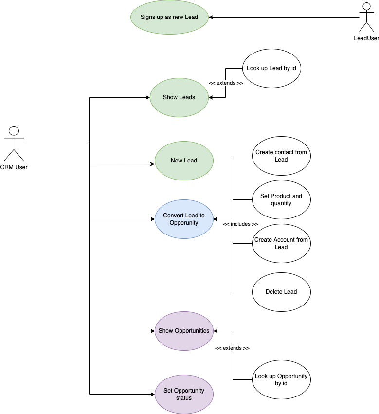
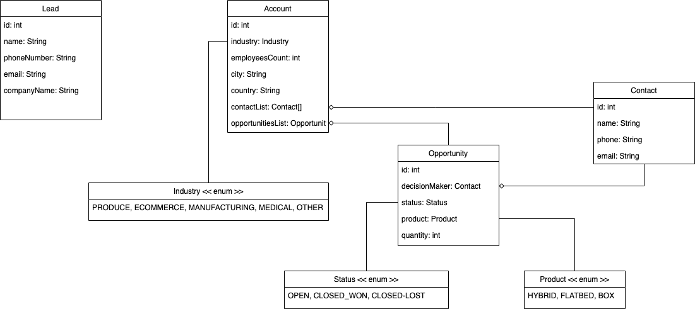
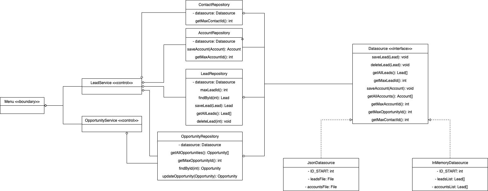

# <h1 style="text-align: center; color : blueviolet; font-family : Courier New;">CRM Project TEAM-5</h1>

<div align="center"></div>
<div>

<h2  style="font-family : Courier New; font-size : 25px;">Team Members :</h2>

- Alejandro Arraiza.
- Miguel A. Correa.
- Isabel Calzadilla.

<!-- TOP ANCHOR WITH ID TO CALL -->
<a href="#top" id="top"></a>

<h2 style="font-family : Courier New; font-size : 25px;">Menu : </h2>

<details>
  <summary>Table of Contents</summary>
  <ol>
    <li>
      <a href="#sintesis">About the Project</a>
      <ul>
        <li><a href="#tecnologias">Built With</a></li>
      </ul>
    </li>
    <li>
      <a href="#aplicacion">Getting Started</a>
      <ul>
        <li><a href="#prerequisites">Prerequisites</a></li>
        <li><a href="#installation">Installation</a></li>
      </ul>
    </li>
    <li><a href="#usage">Usage</a></li>
    <li><a href="#modelo1">Use Case Diagram</a></li>
    <li><a href="#modelo2">Class Diagram</a></li>
    <li><a href="#modelo3">Arch Diagram</a></li>  
  </ol>
</details>

<h2 style="font-family : Courier New; font-size : 25px;" id="sintesis">About the Project</h2>

- screenshots apps
- short explanation


<p align="right">(<a href="#top" >back to top</a>)</p>

<h2 style="font-family : Courier New; font-size : 25px;" id="tecnologias">Tools</h2>


<details>
  <ol>
    <li>
      <a href="#">Backend :</a>
      <ul>
        <li>Java 17.</li>
      </ul>
    </li>
    <li>
      <a href="#">Visual :</a>
      <ul>
        <li>Javax Swing Library</li>
        <li>Alejandro library</li>
      </ul>
    </li>
    <li>
      <a href="#">Sprints :</a>
      <ul>
        <li>GitHub</li>
        <li>GitHub Projects Tools</li>
      </ul>
    </li> 
  </ol>
</details>


<p align="right">(<a href="#top">back to top</a>)</p>


<h2 style="font-family : Courier New; font-size : 25px;" id="aplicacion">Install : </h2>

### Prerequisites

* IDE Java compatible

### Installation

1. Clone the repo 
    ```sh
   git clone https://github.com/J3-PT-Java-Bootcamp/Team5-CRM/tree/master
   ```
2. Install packages

3. NEED HELP FUTHER THINGS ......

<p align="right">(<a href="#top" >back to top</a>)</p>

<h2 style="font-family : Courier New; font-size : 25px;" id="modelo1">Use Case Diagram</h2>



<p align="right">(<a href="#top" >back to top</a>)</p>


<h2 style="font-family : Courier New; font-size : 25px;" id="usage">How to Use</h2>

<p align="right">(<a href="#top" >back to top</a>)</p>

<h2 style="font-family : Courier New; font-size : 25px;" id="modelo2">Class Diagram</h2>



<p align="right">(<a href="#top">back to top</a>)</p>

<h2 style="font-family : Courier New; font-size : 25px;" id="modelo3">Arch Diagram</h2>



<p align="right">(<a href="#top">back to top</a>)</p>

</div>